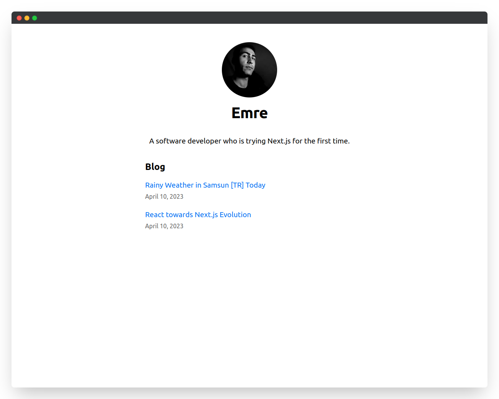
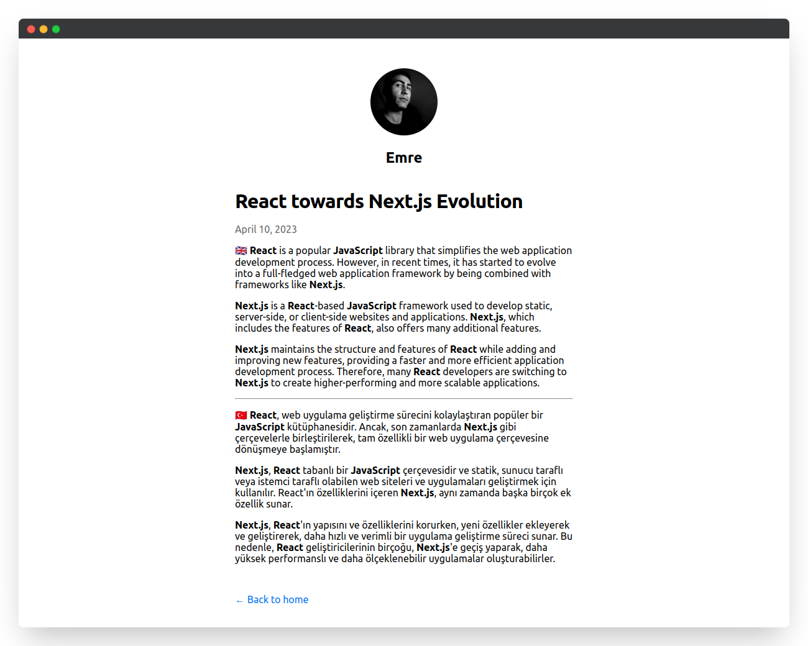

# Next.js Blog App

This is a simple blog app built using Next.js. The app is created as part of the tutorial provided by Next.js.

[Preview on Vercel](https://emreblog.vercel.app/)

## Features

The app includes the following features:

- Home page displaying a list of blog posts
- Individual blog post pages
- Searching post

## Screenshots




## Getting Started

To get started with the app, clone the repository and install the dependencies.

```bash
git clone https://github.com/emrecoban/nextjs-blog.git
cd nextjs-blog
npm install

```

Once the dependencies are installed, you can run the development server using the following command:

```bash
npm run dev
```

The app should now be running on [http://localhost:3000](http://localhost:3000).

## Built with

The app is built using the following technologies:

- Next.js
- React

## Topics

- `Pages` directory: Pages are associated with a route based on their file name.
- `next/link:` Linking between pages in your application.
- `next/image:` Resizing & optimizing images.
- `next/head:` Adding metadatas.
- `next/script:` Loading third-party scripts such as analytics, ads.
- [CSS Modules](https://nextjs.org/docs/basic-features/built-in-css-support): Allow you to locally scope CSS at the component-level by automatically creating unique class names.
- `pages/_app.js:` A top-level React component that wraps all the pages in your application.
- `clsx` library: In className property, it's like a if-statement - [How to use](https://nextjs.org/learn/basics/assets-metadata-css/styling-tips).
- [Pre-rendering](https://nextjs.org/learn/basics/data-fetching/pre-rendering)
- [gray-matter](https://nextjs.org/learn/basics/data-fetching/blog-data): Lets us parse the metadata in each markdown file.
- [getStaticProps](https://nextjs.org/learn/basics/data-fetching/implement-getstaticprops)
- [getServerSideProps](https://nextjs.org/learn/basics/data-fetching/request-time): If you need to fetch data at request time instead of at build time, you can try Server-side Rendering
- [SWR](https://swr.vercel.app/): A React hook for data fetching.
- [remark library](https://nextjs.org/learn/basics/dynamic-routes/render-markdown): To render markdown content, we’ll use the remark library.
- [date-fns library](https://nextjs.org/learn/basics/dynamic-routes/polishing-post-page): To format the date, we’ll use the date-fns library.
- [getStaticPaths](https://nextjs.org/learn/basics/dynamic-routes/dynamic-routes-details): Define your paths auto.

## Acknowledgements

This app was created as part of the tutorial provided by Next.js. The tutorial was very helpful in guiding me through the process of building a blog app using Next.js.

## Conclusion

I hope you find this app useful in learning the basics of Next.js. If you have any questions or comments, feel free to contact me.
